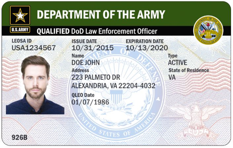

## Law Enforcement Officers Safety Act, LEOSA
<link rel="shortcut icon" type="image/x-icon" href="favicon.ico" />

<!--  -->

The Law Enforcement Officers Safety Act (LEOSA) is a United States federal law, enacted in 2004, that allows two classes of persons - the "QUALIFIED DoD (ACTIVE) Law Enforcement Officer" and the "QUALIFIED DoD (RETIRED or SEPARATED) Law Enforcement Officer" - to carry a concealed firearm in any jurisdiction in the United States or United States Territories, regardless of state or local laws, with certain exceptions.

## Do you meet the LEOSA DoD Requirements?
Click onto each Branch, for info: <a href="https://leosaarmy.com/" target="_blank">Army</a> <> <a href="https://leosaairforce.com/" target="_blank">Air Force</a> <> <a href="https://www.hqmc.marines.mil/ppo/Units/Security-Division-PS/Law-Enforcement-Corrections-PSL/LEOSA/" target="_blank">Marines</a> <> <a href="https://leosanavy.com/" target="_blank">Navy</a>

## Already HR-218 and want to stay compliant?

<a href="https://www.sheepdogacademy.com/" target="_blank">Sheepdog Acadamy</a> - Learning about HR-218/LEOSA rights, Live seminars on HR-218/LEOSA, and concealed carry.

## H.R. 1156: LEOSA Reform Act

<a href="https://www.govtrack.us/congress/bills/116/hr1156" target="_blank">Note: LEOSA Reform Act is pending Legislation</a>

To amend title 18, United States Code, to improve the Law Enforcement Officer Safety Act and provisions relating to the carrying of concealed weapons by law enforcement officers, and for other purposes.
